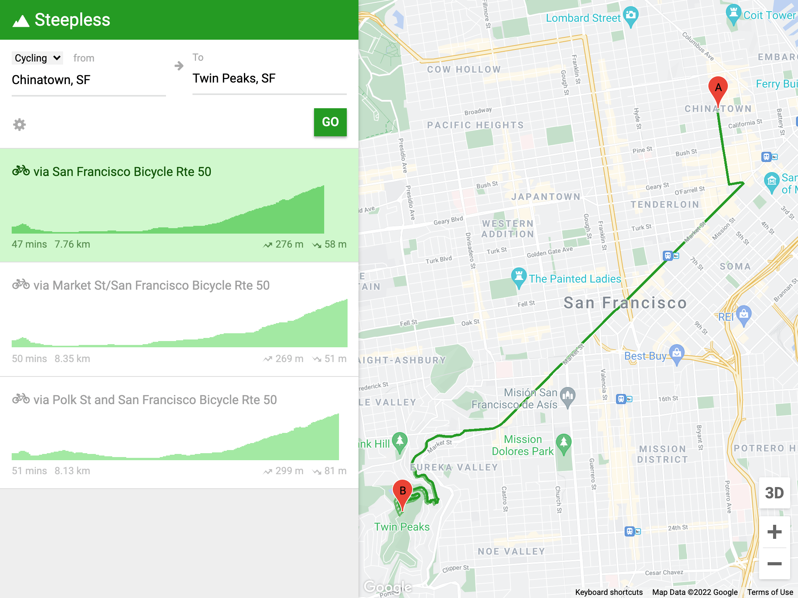
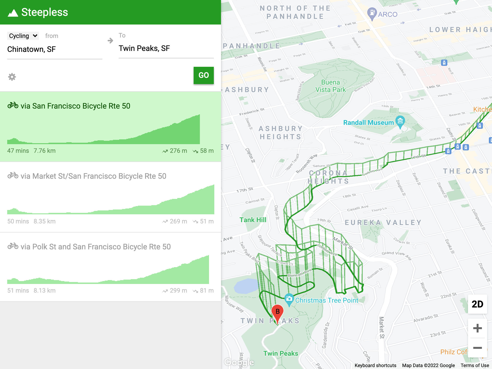

# Steepless

**Steepless** is a web app to find the flattest routes and avoid the hilliest routes.

## Screenshots

## Story time

### September 2014

I visited and stayed in San Francisco for 4 months, and the very first thing I realised that I need is a tool to navigate around the steep hills there. I wanted to build an app for that. I came back to Singapore and finally find the time to build it. And I call it Steepless.

This app also gives me a chance to try out the [React](http://facebook.github.io/react/) library, which I find very interesting.

While building Steepless, I've done a bunch of research and found there are similar attempts by other developers:

- [Bikesy](http://bikesy.com/)
- [Hill Mapper](http://hillmapper.com/)
- [The Steeps Of San Francisco](http://www.datapointed.net/2009/11/the-steeps-of-san-francisco/) and its [sequel](http://www.datapointed.net/2010/02/more-steeps-of-san-francisco/)
- [Flattest Route](http://www.flattestroute.com/)
- [Hillmap](http://www.hillmap.com/)

Steepless is yet another attempt.

### January 2022

It was [my first attempt](https://twitter.com/cheeaun/status/509358952258093056) at building a React.JS app.

[3 years later](https://twitter.com/cheeaun/status/889828805207916545), Google "copied" it, which is apparently [a killer new feature](https://mashable.com/article/google-maps-elevation).

8 years later, I decided to [revive this project](https://twitter.com/cheeaun/status/1481602832231206922).

## Design

The design is initially inspired by a [Google Maps demo for elevation in San Francisco](https://embed-dot-more-than-a-map.appspot.com/demos/routing/elevation) (*link borked*, I couldn't find another or updated link). The rest of the UI is partially inspired by Google's [Material Design](https://material.io/).

The SVG icon sprite is generated with [Fontastic](http://fontastic.me/).

## Development

Requires [Node.js](http://nodejs.org/).

- `npm install` to install the dependencies.
- `npm start` to start the server.

## License

[MIT](http://cheeaun.mit-license.org/)
